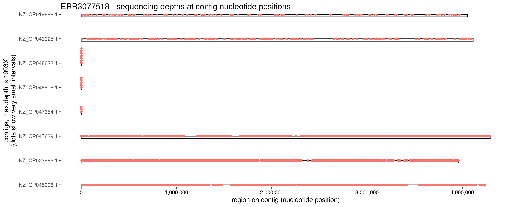
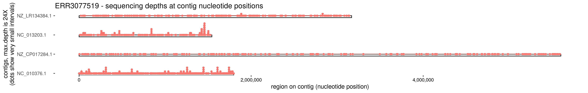
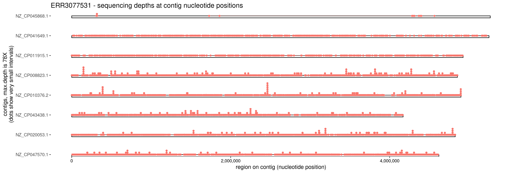
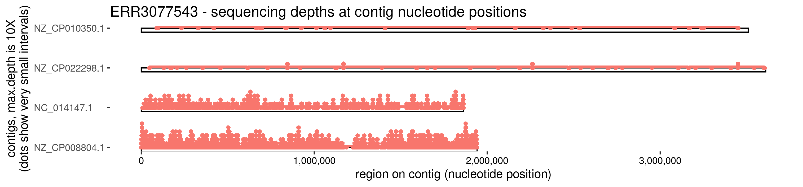

Pipeline for Analysing Nanopore Sequencing of Infection DNA
===========================================================

## Overview

The scripts in this package are part of research efforts to use Nanopore sequencing data to diagnose infection, particularly urinary tract infection (UTI).
The scripts use publicly available software and databases (some converted into Singularity containers for easy installation), and bespoke scripts to filter, analyse, compile, and present the diagnostic results.
The goal of this pipeline is to provide scripts that can easily and quickly be installed on a Linux platform to analyse small volume Nanopore sequencing data.
It is anticipated that this would be convenient for a laboratory using a Linux platform laptop to control a small Nanopore sequencing instrument and store the sequencing data.
The scripts are written in bash and awk, for a Linux operating system. 
Additional scripts are written in the R software platform, and thus additionally require an R installation with R libraries.
These additional R scripts are for the current development and analysis activities, and it is anticipated that they will not be obligatory for the final diagnostic pipeline.
This pipeline is currently under construction. The components currently in this pipeline are:

* Centrifuge_associated_scripts: Scripts to facilitate running Centrifuge and formatting/analysing Centrifuge output
* CARD_RGI_associated_scripts: Scripts to facilitate running RGI with CARDL (or CARD) database, including filtering of input
* Metaflye_associated_scripts: Scripts to facilitate running Metaflye to assemble contigs from sequencing reads
* Medaka_associated_scripts: Scripts to facilitate running Medaka to polish contigs assembled from Nanopore reads
* Prokka_associated_scripts: Scripts to facilites running Prokka to identify bacterial genes in DNA sequences
* analysis_scripts: Bespoke scripts to aid in analysis of Nanopore-sequenced DNA processing and diagnosis
* Releases : Singularity_containers_v1 : binary files for easy installation

Please note: This repository is a work-in-progess.

#### Singularity containers and config.sh

Most (and one day all) of the software in this pipeline are contained in Singularity containers, for ease of installation.
Please install Singularity and then download the Singularity containers. Edit config.sh to point to where the containers have been downloaded.
This will result in the softwares being available to run, as if they were installed individually, because the softwares are installed inside the Singularity containers.
Singularity containers are similar to Docker containers, and, unlike Docker containers, can be used on a machine where you do not have root access.
The Singularity containers for this pipeline are stored on zenodo.org, because they are too big to be stored here in github.

Download the Singularity containers used in this pipeline: 
cd /path/to/downloaded/singularity/containers 
wget https://zenodo.org/records/15250562/files/medaka_singularity.sif?download=1 
wget https://zenodo.org/records/15250727/files/prokka.sif?download=1 
wget https://zenodo.org/records/15250484/files/rgi_singularity.sif?download=1 
wget https://zenodo.org/records/15250767/files/flye_singularity.sif?download=1 

So that the various scripts in this pipeline will know where to find those downloaded containers, update config.sh 
nano config.sh 
(change singularity_directory=/path/to/downloaded/singularity/containers to point to the directory containing the downloaded container) 
(also change the other variables to point to where you have downloaded other data resources and softwares) 

#### Centrifuge_associated_scripts: Scripts to facilitate running Centrifuge and formatting/analysing Centrifuge output

Centrifuge is a software that rapidly identifies bacterial and viral sequences in DNA data ([Kim et al. 2016](https://genome.cshlp.org/content/26/12/1721)).
The script run_centrifuge_using_fastq_input.sh assumes that the Centrifuge software and Centrifuge reference data have already been downloaded and installed as per [Centrifuge download instructions](https://ccb.jhu.edu/software/centrifuge/manual.shtml).
The script run_centrifuge_using_fastq_input.sh simply calls Centrifuge to identify bacterial and viral sequences in DNA data in FASTQ format.
An additional analysis script uses R:
* add_NCBI_names_to_centrifuge_output_for_one_sample.sh : Fetches the name of each identified bacterial/viral/fungal sequence by looking it up at NCBI over the internet.

#### CARD_RGI_associated_scripts: Scripts to facilitate running RGI with CARDL (or CARD) database, including filtering of input

[CARD (Comprehensive Antibiotic Resistance Database)](https://card.mcmaster.ca/) database and [RGI (Resistance Gene Identifier)](https://card.mcmaster.ca/analyze/rgi) is a resource for identifying antimicrobial resistance sequences in bacterial DNA sequences.
Identified resistance mechanisms include genes on plasmids and point mutations.
The latest RGI software is available at [https://github.com/arpcard/rgi](https://github.com/arpcard/rgi).
For convenience of script development (in an environment where root and docker are not available) followed by easy laboratory installation (onto a closed Linux platform so that patient DNA sequences are not required to be uploaded to an outside resource such as the Cloud), some versions of the RGI software appear here as a Singularity container.
Before running RGI, one needs to download the associated CARD data resource, available at [https://card.mcmaster.ca/download](https://card.mcmaster.ca/download).
The CARD/RGI resource is updated frequently, and the older RGI containers may not be compatible with the latest CARD database.
After obtaining the CARD data, it must be initialised before first use:
  wget https://card.mcmaster.ca/latest/data
  tar -xvf data ./card.json
  rgi_singularity_container=/path/to/downloaded/rgi/singularity/container/rgi_2023may.sif
  card_database=/path/to/downloaded/card/database/card.json
  singularity run --cleanenv --no-home $rgi_singularity_container /rgi/rgi load --card_json $card_database --local
The CARD/RGI application requires FASTA formatted DNA sequences as input.
There are various scripts for running CARD/RGI using one of the RGI Singularity containers, depending on the input format you have and what prior filtering needs to be done.
RGI is designed to use fasta formatted input.
Nanopore sequencing data is usually provided in fastq.gz format, which requires bzgip for decompression. An htslib Singularity container is provided for convenience access to bzgip.
Processing fastq sequences through various processes before calling CARD/RGI can merge multiple fastq sequences to produce appropriate high-confidence fasta data for input to CARD/RGI.
However, infection diagnosis usually requires counting the number of DNA sequences having evidence of antimicrobial resistance and counting the number that match organisms, in which case, raw fastq.gz is needed as input to CARD/RGI.
Also, preprocessing processes may require extensive coverage of the sequenced organism, which may not be the case with rapidly sequenced DNA for rapid diagnostic purposed.
When rapidly sequenced DNA is the input and a lot of data and diagnostic information would be dropped by preprocessing processes, then using the raw fastq as input to CARD/RGI may give better results.
When there is too much fastq input data to RGI (to rgi_2023may in particular), then excess sequences can be first removed by the BBTools dedup.sh script from [https://jgi.doe.gov/data-and-tools/software-tools/bbtools/](https://jgi.doe.gov/data-and-tools/software-tools/bbtools/), provided here in the same directory as the RGI Singularity containers for convenience.
* run_rgi_2023may_nudge_cardl_using_fastq_input.sh
* run_rgi_2023may_main_cardl_using_fasta_input.sh (As input to this script, fasta file such as output from metaflye+medaka is needed.)
* run_rgi_2022jun_with_card2020_using_fastq_input.sh
* run_rgi_2022jun_with_card2020_using_fastq_input_filtered_to_remove_human_reads.sh (As input to this script, Centrifuge output is needed.)
* run_rgi_2022jun_with_card2020_using_fasta_input.sh (As input to this script, fasta file such as output from metaflye+medaka is needed.)

#### Metaflye_associated_scripts: Scripts to facilitate running Metaflye to assemble contigs from sequencing reads

Metafly is a software for producing consensus assemblies from multiple long-read sequencing reads such as those of Nanopore ([Kolmogorov et al. 2020](https://www.nature.com/articles/s41592-020-00971-x)).
For convenience for a laboratory installation, a Singularity container is available here.
* run_metaflye_using_fastq_input.sh (If metaflye is not able to assemble even one contig, then there will be no output.)
* run_metaflye_using_fastq_input_filtered_to_remove_human_reads.sh (As input to this script, Centrifuge output is needed. If metaflye is not able to assemble even one contig, then there will be no output.)

#### Medaka_associated_scripts: Scripts to facilitate running Medaka to polish contigs assembled from Nanopore reads

Medaka is a Nanopore-specific tools to polish and improve contigs assembled from Nanopore reads ([https://github.com/nanoporetech/medaka](https://github.com/nanoporetech/medaka)).
It's use is recommended for after contigs have been assembled by Metaflye.
For convenience for a laboratory installation, a Singularity container is available here.
* run_medaka_using_fasta_input.sh (As input to this script, Metaflye fasta output would be used.)

#### Prokka_associated_scripts: Scripts to facilites running Prokka to identify bacterial genes in DNA sequences

Prokka is a software to identify genes in bacterial contig assemblies. It is recommended to use Metaflye+Medaka output as input here.
For convenience for a laboratory installation, a Singularity container is available here.
* run_prokka_using_fasta_input.sh (As input to this script, Metaflye+Medaka fasta output would be used.)

#### analysis_scripts: Bespoke scripts to aid in analysis of Nanopore-sequenced DNA processing and diagnosis

After Centrifuge has identified which bacterial/viral species are in the Nanopore DNA data, let's map the sequencing reads to those species' genomes using Minimap2 and view the result.
Integrative Genomics Viewer (IGV) is a tool typically used to view alignments to reference sequences. However, it doesn't show a high-level view alignments and sequencing coverage (and instead invites you to zoom in to see coverage).
After aligning, let's plot the alignments to the Centrifuge-identified species, to see how well those organisms are covered by sequencing (see further below for example plots).
* fetch_and_align_all_centrifuge_organisms_of_a_sample.sh
* align_reads_to_centrifuge_organisms_having_100_or_more_reads.sh

#### Releases : Singularity_containers_v1 : binary files for easy installation

This pipeline uses several publicly available softwares and is designed to be able to be installed on the same linux laptop controlling the Nanopore sequencing instrument (eg. in a regional hospital diagnostic lab).
To facilitate installation of the various softwares, they are provided as Singularity containers.
Once Singularity has been installed (instructions at [https://docs.sylabs.io/guides/3.0/user-guide/installation.html])(https://docs.sylabs.io/guides/3.0/user-guide/installation.html),
installation of any softwares available as a Singularity container is a simple matter of copying the sif file that is the Singularity container for that software.
To download the Singularity containers used by this pipeline, please carry out the following on the linux command line, and then update any *.sh scripts that your run to set the singularity_directory variable to where you have downloaded:
* wget https://github.com/emmamrath/pipeline_for_analysing_Nanopore_sequencing_of_infection_DNA/releases/download/Singularity_containers_v1/rgi_2022jun.sif

## References

#### Centrifuge
[Kim D, Song L, Breitwieser FP, Salzberg SL.](https://genome.cshlp.org/content/26/12/1721)
[Centrifuge: rapid and sensitive classification of metagenomic sequences.](https://genome.cshlp.org/content/26/12/1721)
[Genome Res. 2016 Dec;26(12):1721-1729. doi: 10.1101/gr.210641.116. Epub 2016 Oct 17. PMID: 27852649; PMCID: PMC5131823.](https://genome.cshlp.org/content/26/12/1721)
[https://github.com/DaehwanKimLab/centrifuge/](https://github.com/DaehwanKimLab/centrifuge/)

#### CARD/RGI
[Alcock BP, Raphenya AR, Lau TTY, Tsang KK, Bouchard M, Edalatmand A, Huynh W, Nguyen AV, Cheng AA, Liu S, Min SY, Miroshnichenko A, Tran HK, Werfalli RE, Nasir JA, Oloni M, Speicher DJ, Florescu A, Singh B, Faltyn M, Hernandez-Koutoucheva A, Sharma AN, Bordeleau E, Pawlowski AC, Zubyk HL, Dooley D, Griffiths E, Maguire F, Winsor GL, Beiko RG, Brinkman FSL, Hsiao WWL, Domselaar GV, McArthur AG.](https://card.mcmaster.ca/about)
[CARD 2020: antibiotic resistome surveillance with the comprehensive antibiotic resistance database.](https://card.mcmaster.ca/about)
[Nucleic Acids Res. 2020 Jan 8;48(D1):D517-D525. doi: 10.1093/nar/gkz935. PMID: 31665441; PMCID: PMC7145624.](https://card.mcmaster.ca/about)

#### Metaflye
[Kolmogorov M, Bickhart DM, Behsaz B, Gurevich A, Rayko M, Shin SB, Kuhn K, Yuan J, Polevikov E, Smith TPL, Pevzner PA.](https://www.nature.com/articles/s41592-020-00971-x)
[metaFlye: scalable long-read metagenome assembly using repeat graphs.](https://www.nature.com/articles/s41592-020-00971-x)
[Nat Methods. 2020 Nov;17(11):1103-1110. doi: 10.1038/s41592-020-00971-x. Epub 2020 Oct 5. PMID: 33020656; PMCID: PMC10699202.](https://www.nature.com/articles/s41592-020-00971-x)

#### Medaka
[medaka: Sequence correction provided by ONT Research.](https://github.com/nanoporetech/medaka)
[https://github.com/nanoporetech/medaka](https://github.com/nanoporetech/medaka) Accessed 2025-01-25.

#### Prokka
[Seemann T.](https://academic.oup.com/bioinformatics/article/30/14/2068/2390517?login=false)
[Prokka: rapid prokaryotic genome annotation.](https://academic.oup.com/bioinformatics/article/30/14/2068/2390517?login=false)
[Bioinformatics. 2014 Jul 15;30(14):2068-9. doi: 10.1093/bioinformatics/btu153. Epub 2014 Mar 18. PMID: 24642063.](https://academic.oup.com/bioinformatics/article/30/14/2068/2390517?login=false)

## Example plots

 
Example 1:

 
Example 2:

 
Example 3:

 
Example 4:

 
